# ☕ Recipe Manager Web App

A modern, feature-rich recipe management application built with vanilla JavaScript, HTML, and CSS. Manage your favorite recipes with a clean, intuitive interface featuring dark mode by default and a beautiful orange accent theme.

## ✨ Features

### Core Functionality
- **CRUD Operations**: Create, Read, Update, and Delete recipes
- **Search & Filter**: Search by recipe title/description, filter by difficulty level and prep time
- **Favorite Recipes**: Mark your favorite dishes with a special badge
- **Persistent Storage**: All data stored in browser's localStorage
- **Responsive Design**: Works seamlessly on desktop, tablet, and mobile devices

### User Interface
- **Dark Theme by Default**: Easy on the eyes with toggle for light mode
- **Orange Accent Theme**: Beautiful orange buttons with white text
- **JetBrains Mono Font**: Clean, modern monospace typography
- **Grid Layout**: Recipe cards displayed in a responsive grid
- **Detailed Recipe View**: Complete ingredient lists and step-by-step instructions
- **Form Validation**: Client-side validation with clear error messages

### Recipe Features
- Title and description
- Ingredient list
- Step-by-step cooking instructions
- Prep time and cook time
- Number of servings
- Difficulty level (Easy/Medium/Hard)
- Optional recipe image (URL)
- Favorite marking

## 🛠️ Tech Stack

- **HTML5**: Semantic markup structure
- **CSS3**: Modern styling with custom properties (CSS variables)
- **JavaScript (ES6)**: Modular, vanilla JavaScript
- **LocalStorage API**: Client-side data persistence

### No Frameworks Required
This project uses pure vanilla JavaScript without any frameworks or libraries, making it:
- Lightweight and fast
- Easy to understand and modify
- No build process needed
- No dependencies to install

## 📁 Project Structure

```
recipe-manager/
│
├── index.html                    # Main HTML structure
│
├── css/
│   └── styles.css                # All styling and theme
│
├── js/
│   ├── app.js                    # Main application initialization
│   ├── storage.js                # LocalStorage operations (CRUD)
│   ├── recipes.js                # Recipe management logic
│   ├── ui.js                     # UI rendering and view management
│   └── utils.js                  # Utility helper functions
│
└── README.md                     # Documentation
```

## 🏗️ Application Architecture

Your Recipe Manager follows a **three-layer architecture** with clear separation of concerns:

### Module Descriptions

**📦 Module Overview:**

1. **app.js** - Entry point that bootstraps the application and initializes all modules

2. **ui.js** - Presentation layer that renders views, handles DOM manipulation and captures user interactions

3. **recipes.js (RecipeManager)** - Business logic layer that processes recipe operations, applies search/filter logic and manages data flow

4. **storage.js** - Data access layer that abstracts localStorage operations with clean CRUD interface (only layer touching localStorage)

5. **utils.js** - Utility module providing helper functions for validation, formatting and common operations

6. **localStorage** - Browser's persistent storage where all recipe data is saved as JSON

### Architecture Flow Diagram

#### Visual Flow (Mermaid Diagram)

```mermaid
graph TB
    subgraph "Entry Point"
        APP[app.js<br/>Initializes entire application]
    end
    
    subgraph "Presentation Layer"
        UI[ui.js<br/>Renders UI, handles user events]
    end
    
    subgraph "Business Logic Layer"
        RM[recipes.js - RecipeManager<br/>Manages recipe operations & filtering logic]
    end
    
    subgraph "Data Access Layer"
        STORAGE[storage.js<br/>Abstracts localStorage CRUD operations]
    end
    
    subgraph "Browser Storage"
        LS[(localStorage<br/>Persists recipe data)]
    end
    
    subgraph "Utilities"
        UTILS[utils.js<br/>Helper functions for validation & formatting]
    end
    
    %% Flow connections
    APP -->|Initializes| RM
    APP -->|Initializes| UI
    
    UI -->|User Actions:<br/>Add/Edit/Delete/Search/Filter| RM
    UI -->|Form Validation| UTILS
    
    RM -->|Load Recipes| STORAGE
    RM -->|Create Recipe| STORAGE
    RM -->|Update Recipe| STORAGE
    RM -->|Delete Recipe| STORAGE
    RM -->|Get Recipe by ID| STORAGE
    RM -->|Uses| UTILS
    
    STORAGE -->|getAllRecipes<br/>saveRecipes<br/>removeAllRecipes| LS
    
    LS -.->|Data Retrieved| STORAGE
    STORAGE -.->|Recipe Data| RM
    RM -.->|Filtered/Processed Data| UI
    UI -.->|Renders| USER[👤 User Interface]
    
    style APP fill:#ff6b35,stroke:#333,stroke-width:3px,color:#fff
    style UI fill:#4a90e2,stroke:#333,stroke-width:2px,color:#fff
    style RM fill:#50c878,stroke:#333,stroke-width:2px,color:#fff
    style STORAGE fill:#9b59b6,stroke:#333,stroke-width:2px,color:#fff
    style LS fill:#e74c3c,stroke:#333,stroke-width:2px,color:#fff
    style UTILS fill:#f39c12,stroke:#333,stroke-width:2px,color:#fff
    style USER fill:#ecf0f1,stroke:#333,stroke-width:2px
```



**Note**: To view the Mermaid diagram, use a Markdown viewer that supports Mermaid (like GitHub, GitLab, VS Code with Mermaid extension, or online Mermaid editors).

### 🔄 Data Flow Pattern

The architecture follows **unidirectional data flow**:

1. **User Interaction** → UI Layer captures events
2. **Business Logic** → RecipeManager processes the request
3. **Data Access** → Storage.js communicates with localStorage
4. **Response** → Data flows back up through the layers
5. **UI Update** → UI Layer re-renders based on new data

**Example Flows:**

**Creating a Recipe:**
```
User clicks "Add Recipe" → UI captures form data → 
RecipeManager.createRecipe() → Storage.addRecipe() → 
localStorage.setItem() → Data saved → UI refreshes
```

**Loading Recipes:**
```
App initializes → RecipeManager.init() → 
RecipeManager.loadRecipes() → Storage.getAllRecipes() → 
localStorage.getItem() → Parse JSON → Return to UI → Render cards
```

**Filtering Recipes:**
```
User types in search → UI captures input → 
RecipeManager.applyAllFilters() → Filter logic applied → 
Filtered data returned → UI re-renders matching recipes
```

### Key Design Principles

1. **Separation of Concerns**: Each layer has a single responsibility
   - Storage.js = Data persistence only
   - RecipeManager = Business logic and filtering
   - UI.js = Presentation and user interaction

2. **Abstraction**: The Storage layer abstracts localStorage operations, making it easy to swap storage mechanisms later (e.g., IndexedDB, API)

3. **Loose Coupling**: Layers communicate through well-defined interfaces, reducing dependencies

4. **Single Source of Truth**: Only Storage.js directly accesses localStorage through three core functions:
   - `getAllRecipes()` - Read operation
   - `saveRecipes()` - Write operation
   - `removeAllRecipes()` - Clear operation

## 🚀 Setup & Installation

### Prerequisites
- A modern web browser (Chrome, Firefox, Safari, Edge)
- No server or Node.js required!

### Installation Steps

1. **Clone or Download** the repository:
   ```bash
   git clone <repository-url>
   cd recipe-manager
   ```

2. **Open the application**:
   - Simply open `index.html` in your web browser
   - Or double-click the `index.html` file

That's it! The app will run directly in your browser.

## 💻 How to Use

### First Launch
On your first visit, the app will automatically load 3 default Indian recipes:
1. **Paneer Butter Masala** ⭐ (Marked as favorite)
2. **Adrak Chai** (Ginger Tea)
3. **Poha** (Flattened Rice)

### Managing Recipes

#### Viewing Recipes
- Browse all recipes in the grid layout on the home page
- Click any recipe card to view full details
- Favorite recipes display a special orange badge

#### Adding a New Recipe
1. Click the "➕ Add Recipe" button
2. Fill in all required fields (marked with *)
3. Optionally add an image URL
4. Click "Save Recipe"

#### Editing a Recipe
1. Click on a recipe card to view details
2. Click the "✏️ Edit" button
3. Modify the fields as needed
4. Click "Save Recipe"

#### Deleting a Recipe
1. Click on a recipe card to view details
2. Click the "🗑️ Delete" button
3. Confirm the deletion

### Search & Filter

#### Search
- Type in the search bar to filter recipes by title or description
- Results update in real-time as you type

#### Filter by Difficulty
- Use the dropdown to filter by Easy, Medium, or Hard recipes
- Select "All Difficulties" to see everything

#### Filter by Prep Time
- Enter a maximum prep time (in minutes)
- Only recipes with prep time less than or equal to your value will show

**Note**: All filters work together simultaneously!

### Theme Toggle
- Click the sun (☀️) or moon (🌙) icon in the header
- Toggle between dark mode (default) and light mode
- Your preference is saved in browser storage

## 🗄️ Data Structure

### Recipe Object Schema

```javascript
{
  id: 1234567890,                    // Unique timestamp ID
  title: "Recipe Name",              // String
  description: "Brief description",   // String
  ingredients: [                      // Array of strings
    "Ingredient 1",
    "Ingredient 2"
  ],
  steps: [                           // Array of strings
    "Step 1",
    "Step 2"
  ],
  prepTime: 30,                      // Number (minutes)
  cookTime: 45,                      // Number (minutes)
  servings: 4,                       // Number
  difficulty: "Medium",              // String: Easy/Medium/Hard
  image: "https://...",              // String (URL, optional)
  isFavorite: false,                 // Boolean
  createdAt: "2025-01-01T00:00:00Z" // ISO date string
}
```

### LocalStorage Key
- **Key**: `recipes`
- **Value**: JSON stringified array of recipe objects

### Accessing Data
All recipes are stored under the `recipes` key in localStorage:

```javascript
// View stored recipes in browser console
JSON.parse(localStorage.getItem('recipes'))

// Clear all recipes
localStorage.removeItem('recipes')
```

## ⚙️ Configuration

### Customizing Theme Colors

Edit `styles.css` to change theme colors:

```css
:root {
    --orange: #ff6b35;        /* Primary button color */
    --orange-hover: #ff5722;  /* Button hover color */
}

.dark-theme {
    --bg-primary: #1a1a1a;    /* Dark background */
    --bg-secondary: #2d2d2d;  /* Card background */
}
```

### Changing Font
Replace the Google Fonts import in `styles.css`:

```css
@import url('https://fonts.googleapis.com/css2?family=YourFont:wght@400;500;600;700&display=swap');

* {
    font-family: 'YourFont', monospace;
}
```

## 🔒 Data Privacy

- All data is stored locally in your browser
- No data is sent to any server
- No cookies or tracking
- Clearing browser data will remove all recipes
- Export/backup functionality can be added if needed

## 🐛 Known Issues & Limitations

1. **Data Loss**: Clearing browser data or localStorage will delete all recipes
2. **No Backup**: Currently no built-in export/import functionality
3. **Image Hosting**: Images must be hosted externally (URLs only)
4. **Browser Storage Limit**: LocalStorage typically has a 5-10MB limit
5. **No User Authentication**: Single-user application per browser
6. **No Cross-Device Sync**: Data is stored per browser/device

## 📝 Validation Rules

### Form Validation
- **Title**: Minimum 3 characters
- **Description**: Minimum 10 characters
- **Ingredients**: At least 1 ingredient required
- **Steps**: At least 1 step required
- **Prep Time**: Minimum 1 minute
- **Cook Time**: Minimum 1 minute
- **Servings**: Minimum 1 serving
- **Difficulty**: Must select Easy, Medium, or Hard
- **Image URL**: Must be a valid URL format (if provided)

## 📱 Browser Compatibility

Tested and working on:
- ✅ Chrome 90+
- ✅ Firefox 88+
- ✅ Safari 14+
- ✅ Edge 90+

## 🚀 Future Enhancements

- Export/Import recipes as JSON
- Print recipe functionality
- Recipe categories and tags
- Shopping list generator
- Meal planning calendar
- Recipe rating system
- Share recipes via URL
- Backend API integration option

---

